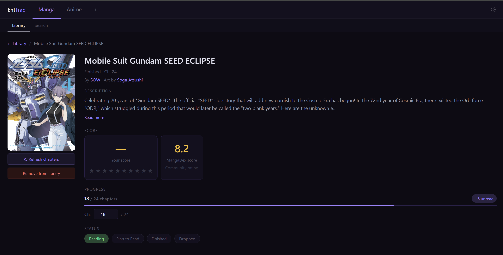
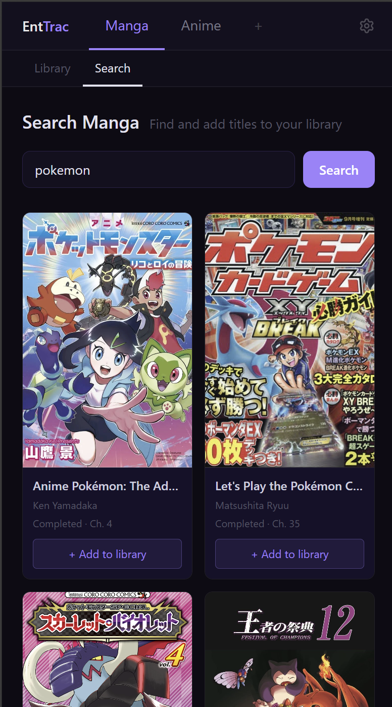

# EntTrac

EntTrac is a personal entertainment tracker built to solve a real problem — life constantly shifts between busy and leisurely, and the entertainment you were enjoying often gets left behind. With so much still coming out and not always enough time to finish everything, EntTrac gives you a central place to track what you're consuming, where you left off, and what's waiting for you.

The project started as a manga and anime tracker and is continuously growing to incorporate more media types and become the best tool it can be.

---

## Screenshots

### Manga Library


### Search


### Detail Page



### Mobile



---

## Tech Stack

**Frontend**

- React 19 + Vite
- Tailwind CSS
- React Router
- Axios

**Backend**

- Java 21 + Spring Boot 3
- AWS DynamoDB (single-table design)
- MangaDex API (manga metadata)
- Jikan/MyAnimeList API (anime metadata)

---

## Features

### Currently Built

- **Manga tab** — search MangaDex, add to library, track reading progress by chapter
- **Anime tab** — search MyAnimeList via Jikan, add to library, track watching progress by episode
- **Library page** — filter by reading/watching status, filter by series status, sort by multiple criteria
- **Detail page** — view metadata, update progress, set score (1-10 with star display), community rating, change status, refresh latest chapter/episode count
- **Cover art** — fetched from MangaDex and MyAnimeList
- **Responsive design** — works on desktop and mobile
- **Status color coding** — card colors reflect reading/watching status across all media types
- **Unread/unwatched tracking** — see at a glance how many chapters or episodes you're behind

### Planned Features

- User notes on detail pages
- Refresh all button on library page (bulk update chapter/episode counts)
- MangaUpdates API integration for improved chapter count accuracy
- TV shows tab
- Books tab
- Movies tab
- AniList as a second anime data source
- Author/creator page (tap a creator name to see all their works)
- Settings page for managing and reordering media tabs
- Multi-user support

---

## Architecture Highlights

- **Single-table DynamoDB design** — all media types stored in one table using `PK = USER#default` and `SK = MEDIA_TYPE#SOURCE#ID` (e.g. `MANGA#MANGADEX#abc123`)
- **MediaItem superclass** — shared fields (title, status, score, description etc) live in one place; `MangaItem` and `AnimeItem` extend it with medium-specific fields
- **Client interface pattern** — `MangaMetadataClient` and `AnimeMetadataClient` interfaces allow swapping or adding API sources without changing service or controller logic
- **Status normalization** — raw API status values (e.g. "Finished Airing", "ongoing") are normalized to a consistent set on save, keeping filters consistent across API sources
- **Universal status enums** — `CONSUMING`, `PLANNED`, `FINISHED`, `DROPPED` work across all media types; display labels ("Reading", "Watching") are mapped per medium on the frontend

---

## Running Locally

### Prerequisites

- Java 21
- Node.js 20+
- AWS account with DynamoDB table named `EntTrac`
- AWS credentials configured locally (`aws configure`)

### DynamoDB Setup

Create a table in your AWS account:

- **Table name:** `EntTrac`
- **Partition key:** `PK` (String)
- **Sort key:** `SK` (String)
- **Region:** `us-east-1` (or update `DynamoDbConfig.java` to match your region)

### Backend

```bash
cd backend
./mvnw spring-boot:run
```

Runs on `http://localhost:8080`

### Frontend

```bash
cd frontend
npm install
npm run dev
```

Runs on `http://localhost:5173`

---

## Project Status

Actively developed as a personal tool and learning project. Built to explore full-stack development with a Java/Spring Boot backend, React frontend, and cloud-native AWS infrastructure.
