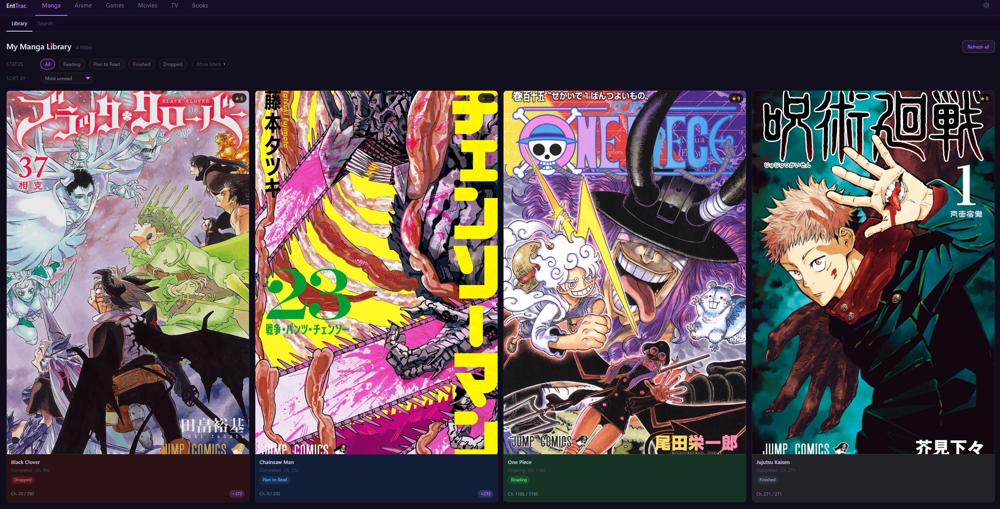
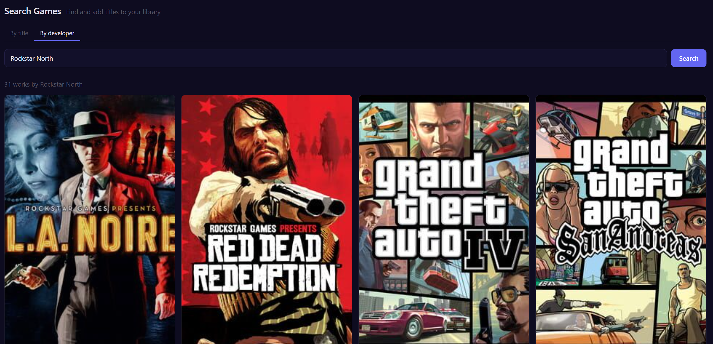
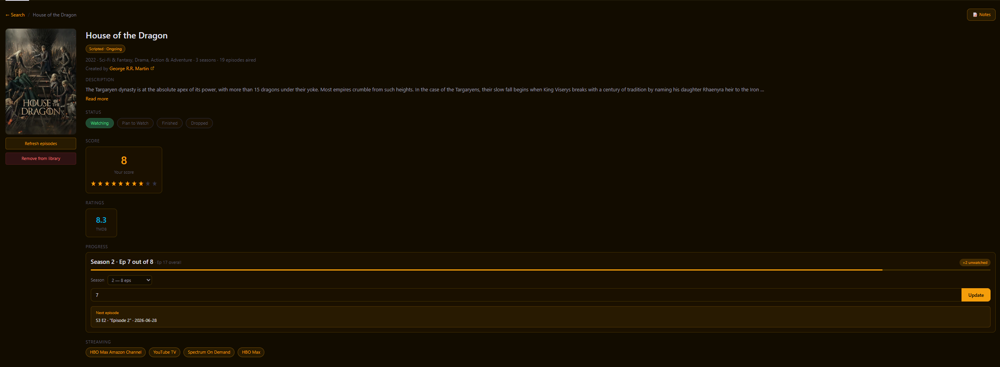
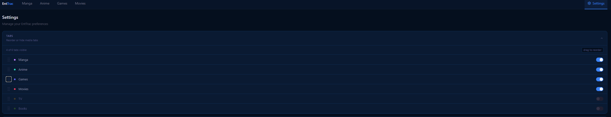
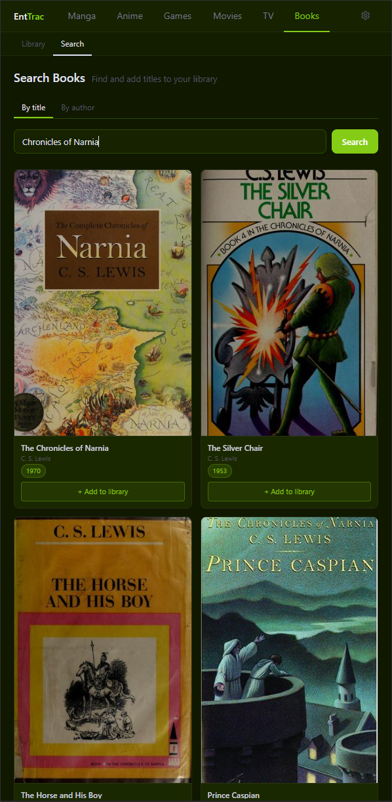

# EntTrac


EntTrac is a personal entertainment tracker built to solve a real problem — life constantly shifts between busy and leisurely, and the entertainment you were enjoying often gets left behind. With so much still coming out and not always enough time to finish everything, EntTrac gives you a central place to track what you're consuming, where you left off, and what's waiting for you.

The project started as a manga and anime tracker and is continuously growing to incorporate more media types and become the best tool it can be.

---

## Screenshots

### Manga Library



### Search



### Detail Page



### Settings



### Mobile




---

## Tech Stack

**Frontend**

- React 19 + Vite
- Tailwind CSS
- React Router
- Axios

**Backend**

- Java 21 + Spring Boot 3
- AWS DynamoDB (single-table design)
- MangaDex API (manga metadata)
- AniList API (anime metadata)
- TMDB API (TV and movie metadata)
- OMDB API (movie ratings — IMDb, Rotten Tomatoes, Metacritic)
- Open Library API (book metadata)
- IGDB API (game metadata, requires Twitch OAuth)

---

## Features

### Currently Built

- **Manga tab** — search MangaDex, add to library, track reading progress by chapter
- **Anime tab** — search AniList, add to library, track watching progress by episode
- **Library page** — filter by reading/watching status, filter by series status, sort by multiple criteria
- **Detail page** — view metadata, update progress, set score (1-10 with star display), community rating, change status, refresh latest chapter/episode count
- **Cover art** — fetched from MangaDex and AniList
- **Responsive design** — works on desktop and mobile
- **Status color coding** — card colors reflect reading/watching status across all media types
- **Unread/unwatched tracking** — see at a glance how many chapters or episodes you're behind
- **User notes** - edit personal notes on any library item's detail page
- **Refresh all** — bulk update chapter/episode counts from the API with progress indicator and rate limit cooldown
- **TV shows tab** — search TMDB, add to library, track watching progress by episode
- **Movies tab** — search TMDB, add to library, view ratings from TMDB, IMDb, Rotten Tomatoes, and Metacritic
- **Source-specific ratings** — each media type displays ratings from its own source (AniList score for anime, MangaDex rating for manga, TMDB rating for TV and movies) cached lazily on first detail page visit
- **Author/creator search page** - search creators using APIs to see their all of their works
- **Settings page** - manage and reorder media tabs
- **Games tab** — search IGDB, add to library, track hours played, platform tracking, DLC ownership checklist, IGDB and critic ratings
- **Books tab** - search Open Library, add to library, track ch and page number
- **Multi-user support** — Google OAuth2 sign-in, per-account libraries, settings synced to your account

### Planned Features

- Google Books as a second data source for the Books tab
- AI-powered natural language search and cross-tab recommendations

---

## Architecture Highlights

- **Single-table DynamoDB design** — all media types stored in one table using `PK = USER#{provider}#{providerId}` per account and `SK = MEDIA_TYPE#SOURCE#ID` (e.g. `MANGA#MANGADEX#abc123`)
- **Stateless authentication with revocable sessions** — Google OAuth2 for identity, then a short-lived signed JWT (access token) plus a DynamoDB-tracked, rotating refresh token (httpOnly cookies). No server-side session store for access tokens; refresh tokens are individually revocable and rotate on every use, so a stolen token has a narrow, self-limiting window
- **MediaItem superclass** — shared fields (title, status, score, description etc) live in one place; `AnimeItem`, `MangaItem`, `TvItem`, `GameItem`, `BookItem`, and `MovieItem` extend it with medium-specific fields
- **Source-specific rating fields** — each subclass owns its own rating field (`malRating`, `mangadexRating`, `tmdbRating`, `imdbRating` etc) rather than a generic `communityRating`, making the data source explicit at the model level
- **Lazy rating enrichment** — source ratings are fetched from external APIs on first detail page visit and cached to DynamoDB; subsequent visits skip the API call entirely
- **Client interface pattern** — each media type has a `MediaMetadataClient` interface allowing API sources to be swapped or extended without changing service or controller logic
- **Status normalization** — raw API status values (e.g. "Finished Airing", "ongoing") are normalized to a consistent set on save, keeping filters consistent across API sources
- **Universal status enums** — `CONSUMING`, `PLANNED`, `FINISHED`, `DROPPED` work across all media types; display labels ("Reading", "Watching") are mapped per medium on the frontend
- **OAuth client credentials token caching** — IGDB requires Twitch OAuth; the access token is cached in the `IgdbClient` Spring bean with lazy refresh on expiry, requiring no scheduled jobs or manual intervention

---

## Running Locally

### Prerequisites

- Java 21
- Node.js 20+
- AWS account with DynamoDB table named `EntTrac`
- AWS credentials configured locally (`aws configure`)
- Google Cloud project with an OAuth 2.0 Client ID (see Google OAuth Setup below)

### DynamoDB Setup

Create a table in your AWS account:

- **Table name:** `EntTrac`
- **Partition key:** `PK` (String)
- **Sort key:** `SK` (String)
- **Region:** `us-east-1` (or update `DynamoDbConfig.java` to match your region)

### Google OAuth Setup

1. Create a project at [console.cloud.google.com](https://console.cloud.google.com) and configure the OAuth consent screen (External audience)
2. Under **Clients**, create a Web application client
3. Add `http://localhost:5173` to Authorized JavaScript origins for local development
4. Copy the generated Client ID

### Backend

Copy `application.properties.template` to `application.properties` in `backend/src/main/resources/` and fill in:
- `jwt.secret` — a random string, 32+ characters (used to sign access tokens)
- `google.oauth.client-id` — the Client ID from Google OAuth Setup above

```bash
cd backend
./mvnw spring-boot:run
```

Runs on `http://localhost:8080`

### Frontend

Create a `.env` file in `frontend/` with:
```
VITE_GOOGLE_CLIENT_ID=your-client-id-here
```

```bash
cd frontend
npm install
npm run dev
```

Runs on `http://localhost:5173`

---

## Project Status

Actively developed as a personal tool and learning project. Built to explore full-stack development with a Java/Spring Boot backend, React frontend, and cloud-native AWS infrastructure.
